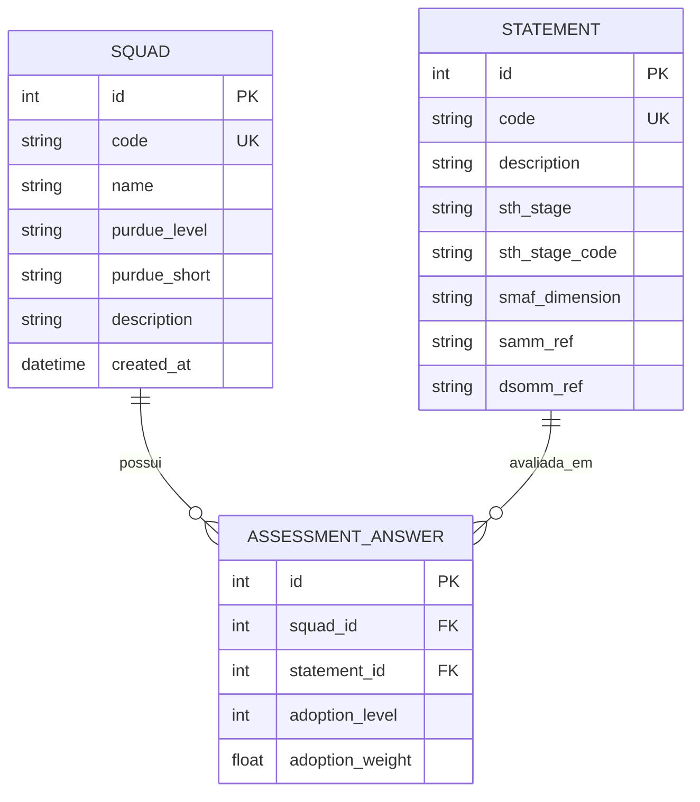

# Data Model: Painel Diagnóstico e Analítico Zeppelin-AppSec

**Feature**: `001-diagnostic-dashboard`
**Status**: Completed
**Date**: 2026-09-23

---

## 1. Visão Geral do Modelo de Dados

O modelo de dados do Zeppelin-AppSec é implementado utilizando **SQLModel** (combinando SQLAlchemy ORM e validação Pydantic v2), persistido em banco de dados relacional **SQLite** (`zeppelin.db`). O modelo reflete fielmente as entidades conceituais descritas na dissertação IFES 2026 e nas planilhas canônicas.



---

## 2. Entidades Relacionais (Tabelas do Banco)

### 2.1 `Squad` (Tabela `squad`)

Representa as equipes de engenharia/desenvolvimento avaliadas segundo os níveis da arquitetura de automação industrial (Modelo Purdue / ISA-95).

| Campo | Tipo SQL | Python/SQLModel | Restrições | Descrição |
|---|---|---|---|---|
| `id` | INTEGER | `Optional[int]` | PRIMARY KEY, AUTOINCREMENT | Identificador numérico único da equipe. |
| `code` | VARCHAR(50) | `str` | UNIQUE, NOT NULL, INDEX | Código curto padronizado (ex.: `squad-a`, `squad-b`, `squad-c`). |
| `name` | VARCHAR(100) | `str` | NOT NULL | Nome de exibição da squad (ex.: `Squad A`). |
| `purdue_level` | VARCHAR(100) | `str` | NOT NULL | Nível no Modelo Purdue (ex.: `Nível 2 — OT / Controle de Processos`). |
| `purdue_short` | VARCHAR(50) | `str` | NOT NULL | Rótulo curto do nível Purdue (ex.: `N2 OT`, `N3 MES`, `N4 ERP`). |
| `description` | TEXT | `str` | NOT NULL | Descrição do escopo de atuação operacional e técnico. |
| `created_at` | DATETIME | `datetime` | NOT NULL, DEFAULT `utc_now` | Timestamp de registro no sistema. |

### 2.2 `Statement` (Tabela `statement`)

Representa cada uma das 40 afirmações atômicas de segurança contínua orientadas à Experiência do Desenvolvedor (DX).

| Campo | Tipo SQL | Python/SQLModel | Restrições | Descrição |
|---|---|---|---|---|
| `id` | INTEGER | `Optional[int]` | PRIMARY KEY, AUTOINCREMENT | Identificador numérico interno. |
| `code` | VARCHAR(20) | `str` | UNIQUE, NOT NULL, INDEX | Código atômico oficial (ex.: `AO.01`, `ARQ.01`, `COD.01`, `VER.01`, `OPE.01`, `GOV.01`). |
| `description` | TEXT | `str` | NOT NULL | Declaração simplificada da prática técnica (foco em DX e atomização). |
| `sth_stage` | VARCHAR(50) | `str` | NOT NULL | Nome do estágio StH (ex.: `Estágio A (Reactive)`). |
| `sth_stage_code` | VARCHAR(5) | `str` | NOT NULL, INDEX | Letra identificadora do estágio (`A`, `B`, `C`, `D`, `E`). |
| `smaf_dimension` | VARCHAR(50) | `str` | NOT NULL, INDEX | Dimensão do framework SMAF (ex.: `Governança`, `Arquitetura e Design`, etc.). |
| `samm_ref` | TEXT | `str` | NOT NULL | Rastreabilidade normativa com práticas do OWASP SAMM v2.0. |
| `dsomm_ref` | TEXT | `str` | NOT NULL | Mapeamento integral com IDs de atividades do OWASP DSOMM v5.0.2. |

### 2.3 `AssessmentAnswer` (Tabela `assessment_answer`)

Representa o registro da avaliação diagnóstica de uma prática específica para uma squad.

| Campo | Tipo SQL | Python/SQLModel | Restrições | Descrição |
|---|---|---|---|---|
| `id` | INTEGER | `Optional[int]` | PRIMARY KEY, AUTOINCREMENT | Identificador único do registro de resposta. |
| `squad_id` | INTEGER | `int` | FOREIGN KEY (`squad.id`), NOT NULL, INDEX | Referência à squad avaliada. |
| `statement_id` | INTEGER | `int` | FOREIGN KEY (`statement.id`), NOT NULL, INDEX | Referência à afirmação atômica respondida. |
| `adoption_level` | INTEGER | `int` | NOT NULL, CHECK(`0 <= adoption_level <= 4`) | Nível na escala de institucionalização (0=AL0, 1=AL1, 2=AL2, 3=AL3, 4=AL4). |
| `adoption_weight` | FLOAT | `float` | NOT NULL | Peso numérico de adoção correspondente (0.0, 0.1, 0.3, 0.6, 1.0). |

*Restrição de Unicidade*: `UNIQUE(squad_id, statement_id)` impede duplicidade de respostas para a mesma squad e afirmação.

---

## 3. Esquemas de Entrada e Saída (Data Transfer Objects - DTOs)

### 3.1 DTOs de Leitura Básica

- **`StatementRead`**:
  ```python
  class StatementRead(BaseModel):
      id: int
      code: str
      description: str
      sth_stage: str
      sth_stage_code: str
      smaf_dimension: str
      samm_ref: str
      dsomm_ref: str
  ```

- **`SquadRead`**:
  ```python
  class SquadRead(BaseModel):
      id: int
      code: str
      name: str
      purdue_level: str
      purdue_short: str
      description: str
  ```

### 3.2 DTOs de Métricas e Agrupamentos

- **`DimensionScore`**:
  ```python
  class DimensionScore(BaseModel):
      dimension: str
      total_items: int
      weight_sum: float
      adoption_degree: float  # Ex: 36.7 para 36.7%
      adoption_degree_formatted: str  # Ex: "36.7%"
  ```

- **`StageScore`**:
  ```python
  class StageScore(BaseModel):
      stage: str
      stage_code: str
      total_items: int
      weight_sum: float
      adoption_degree: float  # Ex: 60.0 para 60.0%
      adoption_degree_formatted: str  # Ex: "60.0%"
      al_counts: dict[str, int]  # Ex: {"AL0": 1, "AL1": 0, "AL2": 0, "AL3": 2, "AL4": 0}
  ```

- **`StatementAssessmentDetail`**:
  ```python
  class StatementAssessmentDetail(BaseModel):
      statement_code: str
      description: str
      smaf_dimension: str
      sth_stage: str
      adoption_level_code: str  # "AL0" a "AL4"
      adoption_level_num: int   # 0 a 4
      adoption_level_name: str  # "Não Adotada", "Abandonada", etc.
      adoption_weight: float    # 0.0, 0.1, 0.3, 0.6, 1.0
      adoption_degree_pct: str  # "0%", "10%", "30%", "60%", "100%"
      samm_ref: str
      dsomm_ref: str
  ```

- **`SquadDiagnosticSummary`**:
  ```python
  class SquadDiagnosticSummary(BaseModel):
      squad: SquadRead
      global_adoption_degree: float          # Ex: 20.3
      global_adoption_degree_formatted: str  # Ex: "20.3%"
      predominant_stage: str                 # Estágio de maior alinhamento
      al_distribution: dict[str, int]        # Ex: {"AL0": 18, "AL1": 2, "AL2": 8, "AL3": 10, "AL4": 2}
      dimension_scores: list[DimensionScore] # 6 dimensões SMAF
      stage_scores: list[StageScore]         # 5 estágios StH
      statements: list[StatementAssessmentDetail] # Detalhamento dos 40 itens
  ```

- **`BenchmarkSummary`**:
  Matriz de comparação contendo as pontuações dimensionais e globais das três squads (Squad A, Squad B, Squad C) e a Média Geral da Organização (52,0%).

