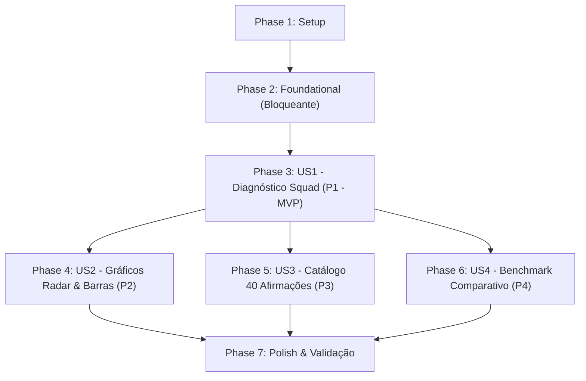

# Tasks: Painel Diagnóstico e Analítico Zeppelin-AppSec

**Feature**: `001-diagnostic-dashboard`  
**Input**: Plan from `specs/001-diagnostic-dashboard/plan.md`, Spec from `specs/001-diagnostic-dashboard/spec.md`, Data Model from `specs/001-diagnostic-dashboard/data-model.md`, Contracts from `specs/001-diagnostic-dashboard/contracts/`

---

## Phase 1: Setup (Shared Infrastructure)

**Purpose**: Inicialização do projeto, configuração de dependências e estrutura de diretórios.

- [X] T001 Definir dependências do projeto (`fastapi`, `uvicorn`, `sqlmodel`, `pandas`, `openpyxl`, `jinja2`, `pytest`, `httpx`) em `requirements.txt`
- [X] T002 [P] Criar a estrutura de diretórios do projeto para templates, assets estáticos e testes em `templates/`, `static/` e `tests/`
- [X] T003 [P] Inicializar pacote de testes e fixtures compartilhadas do FastAPI/SQLite em `tests/__init__.py` e `tests/conftest.py`

---

## Phase 2: Foundational (Blocking Prerequisites)

**Purpose**: Infraestrutura central de dados, modelos SQLModel, módulo de cálculo matemático e carga de sementes (seed) que bloqueiam a implementação das histórias de usuário.

**⚠️ CRITICAL**: Nenhuma história de usuário pode ser iniciada antes da conclusão desta fase.

- [X] T004 Criar entidades SQLModel (`Squad`, `Statement`, `AssessmentAnswer`) e esquemas Pydantic (`StatementRead`, `SquadRead`, `DimensionScore`, `StageScore`, `SquadDiagnosticSummary`, `BenchmarkSummary`) em `models.py`
- [X] T005 [P] Implementar módulo de cálculo matemático da escala de institucionalização (AL0 a AL4 com pesos 0.0, 0.1, 0.3, 0.6, 1.0) e fórmulas de Grau de Adoção ($AD_k$ e $AD_{global}$) em `models.py`
- [X] T006 [P] Implementar testes unitários para o módulo matemático com conferência dos valores canônicos da dissertação em `tests/test_math.py`
- [X] T007 Configurar conexão com SQLite (`zeppelin.db`), engine com suporte a WAL/threads e gerador de sessão transacional `get_session` em `database.py`
- [X] T008 Implementar rotina de carga inicial automatizada e idempotente `seed_database(session)` a partir de `docs/zeppelin_appsec_40_afirmacoes.xlsx` e `docs/simulacao_zeppelin_appsec_3_squads.xlsx` em `database.py`
- [X] T009 [P] Implementar testes unitários para validar a criação das tabelas e a integridade da carga das 40 afirmações e 3 squads em `tests/test_seed.py`
- [X] T010 Configurar inicialização da aplicação FastAPI com lifespan assíncrono para execução do `seed_database` na inicialização do servidor em `main.py`

**Checkpoint**: Base de dados provisionada, sementes carregadas e módulo matemático testado com 100% de precisão. O desenvolvimento das histórias de usuário pode prosseguir.

---

## Phase 3: User Story 1 - Diagnóstico e Métricas Executivas por Squad (Priority: P1) 🎯 MVP

**Goal**: Permitir que o usuário selecione uma squad industrial (Squad A, Squad B ou Squad C) e visualize instantaneamente seu diagnóstico consolidado de maturidade ($AD_{global}$, estágio predominante e distribuição de níveis AL0 a AL4).

**Independent Test**: Executar os testes de integração da API e acessar o dashboard, selecionando individualmente cada uma das três equipes para confirmar a exibição exata de seus Graus de Adoção Globais (Squad A: 20,3%; Squad B: 47,0%; Squad C: 88,7%).

### Tests for User Story 1 ⚠️

- [X] T011 [P] [US1] Implementar testes de integração com TestClient para os endpoints `/api/squads` e `/api/diagnostics/{squad_id_or_code}` em `tests/test_api.py`

### Implementation for User Story 1

- [X] T012 [P] [US1] Implementar endpoint REST `GET /api/squads` para listagem das equipes industriais segundo o Modelo Purdue em `main.py`
- [X] T013 [US1] Implementar endpoint REST `GET /api/diagnostics/{squad_id_or_code}` retornando o diagnóstico consolidado da squad em `main.py`
- [X] T014 [US1] Construir estrutura HTML5 semântica com cabeçalho corporativo Zeppelin, seletor dinâmico de squad e cards de métricas executivas em `templates/index.html`
- [X] T015 [US1] Implementar lógica client-side em JavaScript para carregar as squads, consultar o diagnóstico da equipe selecionada e preencher os cards de métricas em `static/app.js`

**Checkpoint**: User Story 1 funcional e testável de forma autônoma como MVP.

---

## Phase 4: User Story 2 - Visualização Gráfica Analítica (Radar SMAF e Barras StH) (Priority: P2)

**Goal**: Renderizar no painel o Gráfico Radar das 6 dimensões SMAF e o Gráfico de Barras Empilhadas dos 5 estágios StH-AppSec (discriminando os níveis AL0 a AL4) com as cores da identidade visual corporativa do Zeppelin Analytics.

**Independent Test**: Selecionar qualquer squad no dashboard e validar que o gráfico Radar plota as 6 dimensões com escala de 0% a 100% e o gráfico de Barras ilustra os 5 estágios (A ao E) com a contagem exata de práticas em cada nível de institucionalização.

### Implementation for User Story 2

- [X] T016 [P] [US2] Adicionar containers responsivos e elementos `<canvas>` para o gráfico Radar SMAF e gráfico de Barras StH em `templates/index.html`
- [X] T017 [US2] Implementar função de renderização e configuração do Gráfico Radar Chart.js com escala radial 0–100% e paleta corporativa Navy/Royal em `static/app.js`
- [X] T018 [US2] Implementar função de renderização e configuração do Gráfico de Barras Empilhadas Chart.js com os 5 estágios StH e 5 séries de níveis AL em `static/app.js`
- [X] T019 [US2] Implementar atualização reativa dos gráficos e destruição de instâncias anteriores ao alterar a squad no seletor em `static/app.js`

**Checkpoint**: User Stories 1 e 2 operacionais, fornecendo visualização de métricas e gráficos analíticos completos.

---

## Phase 5: User Story 3 - Consulta e Rastreabilidade das 40 Afirmações Atômicas (Priority: P3)

**Goal**: Disponibilizar o catálogo completo das 40 afirmações atômicas avaliadas, permitindo leitura da declaração simplificada voltada a DX, visualização do nível de adoção assinalado para a squad e conferência dos mapeamentos normativos (OWASP SAMM v2.0 e OWASP DSOMM v5.0.2).

**Independent Test**: Consultar o endpoint `GET /api/statements` e validar que a tabela no dashboard exibe as 40 afirmações com filtros funcionais por dimensão SMAF e estágio StH-AppSec.

### Tests for User Story 3 ⚠️

- [X] T020 [P] [US3] Implementar testes de integração para o endpoint `GET /api/statements` com filtros de dimensão e estágio em `tests/test_api.py`

### Implementation for User Story 3

- [X] T021 [US3] Implementar endpoint REST `GET /api/statements` suportando parâmetros de consulta opcionais `dimension` e `stage` em `main.py`
- [X] T022 [US3] Adicionar tabela detalhada de afirmações com filtros rápidos por dimensão SMAF e estágio StH em `templates/index.html`
- [X] T023 [US3] Implementar preenchimento dinâmico da tabela de afirmações, badges coloridos por nível AL e filtragem em `static/app.js`

**Checkpoint**: User Stories 1, 2 e 3 totalmente integradas, permitindo auditar cada uma das 40 afirmações.

---

## Phase 6: User Story 4 - Comparativo Organizacional e Benchmark Industrial (Priority: P4)

**Goal**: Exibir uma visualização comparativa consolidada apresentando lado a lado as três squads industriais (Purdue Níveis 2, 3 e 4) e a Média Geral da Organização (52,0%).

**Independent Test**: Consultar `GET /api/benchmark` e conferir se a visualização comparativa consolida a matriz de maturidade de todas as dimensões e o Grau de Adoção Global das squads e da organização.

### Tests for User Story 4 ⚠️

- [X] T024 [P] [US4] Implementar testes de integração para o endpoint `GET /api/benchmark` em `tests/test_api.py`

### Implementation for User Story 4

- [X] T025 [US4] Implementar endpoint REST `GET /api/benchmark` agregando as métricas das 3 squads e a média global em `main.py`
- [X] T026 [US4] Adicionar seção ou modal de visualização comparativa de benchmark organizacional em `templates/index.html`
- [X] T027 [US4] Implementar renderização da matriz de benchmark industrial comparativa em `static/app.js`

**Checkpoint**: Todas as 4 histórias de usuário concluídas e integradas.

---

## Phase 7: Polish & Cross-Cutting Concerns

**Purpose**: Ajustes finais de estilização, montagem de rotas estáticas, documentação e validação integral.

- [X] T028 [P] Configurar montagem de diretório de arquivos estáticos (`/static`) e rota raiz (`GET /`) servindo o template Jinja2 em `main.py`
- [X] T029 [P] Ajustar responsividade de layout Tailwind CSS, tipografia e contraste visual para telas desktop, tablet e mobile em `templates/index.html`
- [X] T030 Executar suíte completa de testes automatizados (`pytest -v`) e validar os cenários de ponta a ponta descritos em `specs/001-diagnostic-dashboard/quickstart.md`

---

## Dependencies & Execution Order

### Phase Dependencies

- **Phase 1 (Setup)**: Concluída.
- **Phase 2 (Foundational)**: Concluída.
- **Phase 3 (US1 - MVP)**: Concluída.
- **Phase 4 (US2)**, **Phase 5 (US3)** e **Phase 6 (US4)**: Concluídas.
- **Phase 7 (Polish)**: Concluída.

---

## Parallel Execution Opportunities

- **Tarefas de Setup**: `T002` e `T003` executadas em paralelo com `T001`.
- **Tarefas Fundacionais**: `T005` e `T006` desenvolvidas em paralelo com `T007` e `T008`.
- **Testes por História de Usuário**:
  - `T011` (testes US1) escrito e aprovado.
  - `T020` (testes US3) escrito e aprovado.
  - `T024` (testes US4) escrito e aprovado.
- **Frontend vs Backend**:
  - Estruturação de `templates/index.html` e `static/app.js` integrada harmoniosamente com `main.py`.

---

## Implementation Strategy

### Estratégia de Entrega Incremental (MVP Primeiro)

1. **Etapa 1 (Fundação)**: Setup (T001–T003) e Foundational (T004–T010) concluídos. O banco `zeppelin.db` armazena 40 afirmações e 3 squads com testes passando.
2. **Etapa 2 (MVP - User Story 1)**: T011–T015 concluídos. Seletor de squad e cards métricos com $AD_{global}$ exato: 20,3%, 47,0% e 88,7%.
3. **Etapa 3 (Gráficos - User Story 2)**: T016–T019 concluídos. Gráfico Radar SMAF e Gráfico de Barras StH integrados via Chart.js.
4. **Etapa 4 (Catálogo - User Story 3)**: T020–T023 concluídos. Tabela com as 40 afirmações atômicas e filtros por dimensão/estágio operando perfeitamente.
5. **Etapa 5 (Benchmark - User Story 4)**: T024–T027 concluídos. Comparativo executivo das 3 squads e média da organização (52,0%) ativo.
6. **Etapa 6 (Polimento)**: T028–T030 concluídos com cobertura total de 18 testes automatizados passando.
