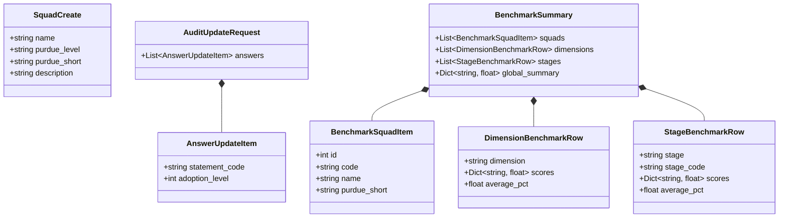
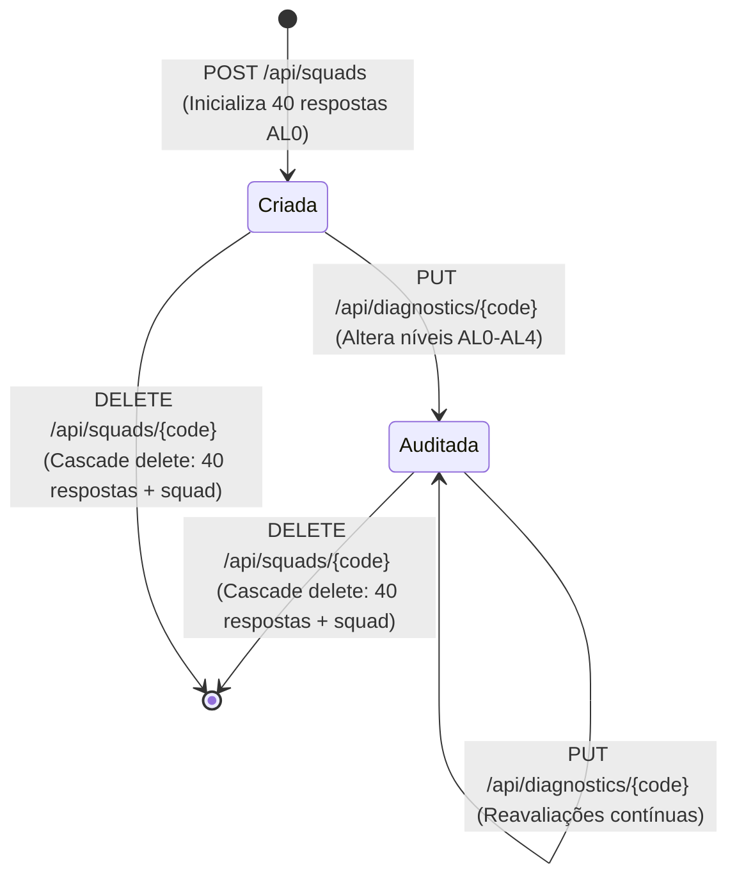

# Data Model: Gestão de Squads, Edição de Auditoria e Benchmark StH-AppSec

**Feature**: `002-squad-audit-management`
**Status**: Completed
**Date**: 2026-09-23

---

## 1. Visão Geral das Entidades e Extensões de DTOs

O modelo relacional centralizado em `models.py` é mantido sem necessidade de migração estrutural nas tabelas físicas (`squad`, `statement`, `assessment_answer`). Novas classes de transferência de dados (DTOs) são introduzidas para suportar criação de squads, atualização em lote de auditorias e benchmarking dinâmico.



---

## 2. Novos DTOs Pydantic

### 2.1 `SquadCreate` (Requisição de Cadastro de Squad)

```python
class SquadCreate(BaseModel):
    name: str = Field(min_length=2, max_length=100, description="Nome de exibição da squad")
    purdue_level: str = Field(min_length=3, max_length=100, description="Camada do Modelo Purdue (ISA-95)")
    purdue_short: str = Field(min_length=2, max_length=50, description="Rótulo curto da camada Purdue (ex: N2 OT, N3 MES)")
    description: str = Field(default="", max_length=500, description="Descrição do escopo operacional")
```

- **Regras de Validação**:
  - `name` não pode ser vazio ou composto apenas de espaços.
  - `purdue_level` deve conter identificação válida de nível industrial.
  - O sistema gera automaticamente um slug único em minúsculas para o campo `code` (ex.: `"Squad Manufatura"` -> `"squad-manufatura"`).
  - São criados automaticamente 40 registros em `assessment_answer` vinculando a nova squad a cada uma das 40 afirmações com `adoption_level = 0` e `adoption_weight = 0.0`.

### 2.2 `AuditUpdateRequest` e `AnswerUpdateItem` (Requisição de Atualização de Auditoria)

```python
class AnswerUpdateItem(BaseModel):
    statement_code: str = Field(description="Código atômico da afirmação (ex: AO.01, ARQ.01)")
    adoption_level: int = Field(ge=0, le=4, description="Nível de institucionalização assinalado (0 a 4)")

class AuditUpdateRequest(BaseModel):
    answers: list[AnswerUpdateItem] = Field(min_length=1, max_length=40, description="Lista de respostas a serem atualizadas")
```

- **Regras de Validação**:
  - `adoption_level` restrito estritamente ao intervalo $[0, 4]$.
  - Cada `statement_code` deve corresponder a uma afirmação válida existente no catálogo.
  - O peso correspondente é atribuído deterministicamente pela função `get_adoption_weight(level)`.
  - A atualização é executada em uma única transação SQLite atômica.

### 2.3 `BenchmarkSummary` Dinâmico para N Squads

```python
class BenchmarkSquadItem(BaseModel):
    id: int
    code: str
    name: str
    purdue_short: str

class DimensionBenchmarkRow(BaseModel):
    dimension: str
    scores: dict[str, float]  # ex: {"squad-a": 36.7, "squad-b": 55.0, ...}
    squad_a_pct: float        # preservado para compatibilidade retroativa
    squad_b_pct: float
    squad_c_pct: float
    average_pct: float

class StageBenchmarkRow(BaseModel):
    stage: str
    stage_code: str
    scores: dict[str, float]  # ex: {"squad-a": 60.0, "squad-b": 60.0, ...}
    squad_a_pct: float
    squad_b_pct: float
    squad_c_pct: float
    average_pct: float

class BenchmarkSummary(BaseModel):
    squads: list[BenchmarkSquadItem]
    dimensions: list[DimensionBenchmarkRow]
    stages: list[StageBenchmarkRow]
    global_summary: dict[str, float]  # ex: {"squad-a": 20.3, "squad-b": 47.0, ..., "organization_average_pct": 52.0}
```

### 2.4 `SquadDeleteResponse` (Resposta de Exclusão de Squad)

```python
class SquadDeleteResponse(BaseModel):
    message: str = Field(description="Mensagem informativa de confirmação da exclusão")
    deleted_code: str = Field(description="Slug da squad excluída")
    deleted_id: int = Field(description="ID numérico da squad excluída")
```

---

## 3. Ciclo de Vida e Limpeza em Cascata (Cascade Delete)



- **Operação de Deleção**:
  1. `DELETE FROM assessment_answer WHERE squad_id = :id;`
  2. `DELETE FROM squad WHERE id = :id;`
  3. `session.commit()`
- **Consistência**: Nenhuma chave estrangeira órfã é deixada na tabela `assessment_answer`. As consultas subsequentes a `Squad` e `BenchmarkSummary` passam a ignorar imediatamente os dados da equipe removida.

