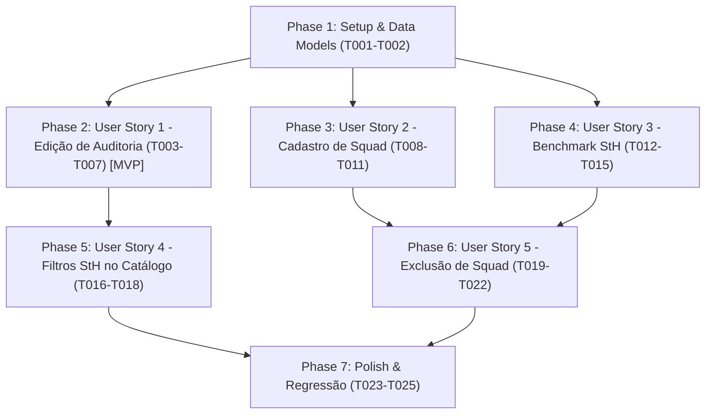

# Tasks: Gestão de Squads, Edição de Auditoria e Benchmark StH-AppSec

**Feature**: `002-squad-audit-management`  
**Input**: Plan from [`specs/002-squad-audit-management/plan.md`](file:///home/user/felipe/speckit/appsec/specs/002-squad-audit-management/plan.md), Spec from [`specs/002-squad-audit-management/spec.md`](file:///home/user/felipe/speckit/appsec/specs/002-squad-audit-management/spec.md), Data Model from [`specs/002-squad-audit-management/data-model.md`](file:///home/user/felipe/speckit/appsec/specs/002-squad-audit-management/data-model.md), Contracts from [`specs/002-squad-audit-management/contracts/`](file:///home/user/felipe/speckit/appsec/specs/002-squad-audit-management/contracts/)

---

## Phase 1: Setup & Foundational (DTOs e Estruturas de Dados Compartilhadas)

**Purpose**: Definição dos novos DTOs Pydantic e estruturas de requisição/resposta que suportam todas as histórias de usuário da feature.

**⚠️ CRITICAL**: A extensão dos modelos de dados em `models.py` é pré-requisito para os endpoints de API e para os testes automatizados.

- [X] T001 Adicionar novos DTOs Pydantic (`SquadCreate`, `AnswerUpdateItem`, `AuditUpdateRequest`, `BenchmarkSquadItem`, `StageBenchmarkRow`, e estrutura dinâmica para `DimensionBenchmarkRow` e `BenchmarkSummary`) em `models.py`
- [X] T002 [P] Atualizar fixtures e helpers em `tests/conftest.py` ou `tests/test_api.py` para suportar testes de criação de squad e atualização de auditoria em banco de dados isolado

**Checkpoint**: Novos DTOs tipados disponíveis para injeção nos controllers FastAPI e na suíte de testes.

---

## Phase 2: User Story 1 - Edição e Persistência da Auditoria de uma Squad (Priority: P1) 🎯 MVP

**Goal**: Permitir que o usuário altere os níveis de institucionalização (AL0 a AL4) assinalados para qualquer uma das 40 afirmações atômicas de uma squad e salve as alterações persistentemente no SQLite `zeppelin.db`, recalculando instantaneamente todos os scores ($AD_{global}$, dimensões SMAF, estágios StH e gráficos).

**Independent Test**: Selecionar uma squad (ex.: Squad A), acionar o modo de edição, alterar o nível de uma prática (ex.: AO.01 de AL3 para AL4), clicar em salvar e recarregar a página para confirmar a persistência dos novos valores e o recálculo imediato dos cards de métricas e gráficos.

### Tests for User Story 1 ⚠️

- [X] T003 [P] [US1] Implementar testes automatizados para o endpoint `PUT /api/diagnostics/{squad_id_or_code}` em `tests/test_api.py` (validando atualização bem-sucedida, persistência dos novos pesos, recálculo correto de $AD_{global}$ e rejeição de níveis fora de 0 a 4)

### Implementation for User Story 1

- [X] T004 [US1] Implementar endpoint REST `PUT /api/diagnostics/{squad_id_or_code}` em `main.py` com transação SQLite atômica para atualização em lote de `AssessmentAnswer` e retorno do diagnóstico consolidado recalculado
- [X] T005 [US1] Adicionar botão "Editar Auditoria" / "Salvar Alterações", mensagens de status e containers de feedback visual na seção do catálogo de afirmações em `templates/index.html`
- [X] T006 [US1] Implementar alternância de modo de edição em `static/app.js`, substituindo os badges estáticos de nível por `<select>` interativos com opções AL0 a AL4 e cores semânticas correspondentes
- [X] T007 [US1] Implementar rotina de salvamento e envio assíncrono via `PUT /api/diagnostics/{code}` em `static/app.js`, atualizando os cards de métricas, tabela e re-renderizando os gráficos Chart.js (Radar SMAF e Barras StH)

**Checkpoint**: User Story 1 concluída e testável de forma autônoma como MVP. Edição e salvamento funcionais e persistentes no banco de dados local.

---

## Phase 3: User Story 2 - Cadastro e Persistência de Nova Squad (Priority: P2)

**Goal**: Permitir o cadastro de uma nova squad informando nome, nível de automação industrial no Modelo Purdue (ISA-95) e escopo de atuação, inicializando automaticamente as 40 afirmações atômicas com nível AL0 no SQLite.

**Independent Test**: Acionar o botão "+ Nova Squad", preencher o formulário modal (ex.: "Squad Manufatura", "N2 OT", "Controle de linha"), submeter o formulário e verificar se a nova squad é exibida no seletor de equipes e carregada no painel com $AD_{global} = 0{,}0\%$ e 40 afirmações prontas para auditoria.

### Tests for User Story 2 ⚠️

- [X] T008 [P] [US2] Implementar testes automatizados para o endpoint `POST /api/squads` em `tests/test_api.py` (validando criação de squad, geração de slug, inserção automática das 40 respostas AL0 e tratamento de nomes duplicados)

### Implementation for User Story 2

- [X] T009 [US2] Implementar endpoint REST `POST /api/squads` em `main.py`, gerando slug unívoco, persistindo a entidade `Squad` e gerando em lote 40 registros em `AssessmentAnswer` vinculados às 40 afirmações com nível 0 e peso 0.0
- [X] T010 [US2] Construir modal acessível de cadastro de nova squad com campos Nome, Nível Purdue, Rótulo Curto e Descrição em `templates/index.html`
- [X] T011 [US2] Implementar botão único "+ Nova Squad" alinhado ao seletor de squads, abertura/fechamento do modal e submissão via `POST /api/squads` em `static/app.js`, inserindo a nova squad no `<select>`, ativando sua seleção e carregando seu painel diagnóstico inicial

**Checkpoint**: User Stories 1 e 2 operacionais. É possível criar novas squads e imediatamente editar suas auditorias com persistência no banco.

---

## Phase 4: User Story 3 - Matriz de Benchmarking por Estágio StH-AppSec (Priority: P3)

**Goal**: Manter a matriz de benchmarking de adoção por dimensão SMAF e adicionar a matriz de benchmarking de adoção por estágio StH-AppSec (Estágios A ao E) em consonância com a Tabela 4.2 da dissertação de referência (`docs/SDL.pdf`), comparando todas as squads registradas e a média organizacional, padronizando a linha de rodapé com GRAU DE ADOÇÃO GLOBAL (AD%).

**Independent Test**: Consultar a seção de benchmarking e validar a exibição de duas tabelas executivas completas: a matriz por dimensão SMAF (6 dimensões) e a nova matriz por estágio StH-AppSec (Estágios A ao E), com colunas para cada squad, média geral e linha de rodapé com GRAU DE ADOÇÃO GLOBAL (AD%).

### Tests for User Story 3 ⚠️

- [X] T012 [P] [US3] Implementar testes automatizados para a versão estendida de `GET /api/benchmark` em `tests/test_api.py` (conferindo valores da Tabela 4.2 para as squads canônicas A, B e C e integridade com squads adicionais)

### Implementation for User Story 3

- [X] T013 [US3] Refatorar endpoint `GET /api/benchmark` em `main.py` para consultar dinamicamente todas as squads do banco de dados, calcular os scores por dimensão SMAF e por estágio StH-AppSec, computando as médias organizacionais
- [X] T014 [US3] Adicionar estrutura HTML5, cabeçalho executivo e rodapé `GRAU DE ADOÇÃO GLOBAL (AD%)` para a Tabela de Benchmarking por Estágio StH-AppSec (Tabela 4.2) na seção de benchmark em `templates/index.html`
- [X] T015 [US3] Atualizar a função `loadBenchmarkData()` em `static/app.js` para renderizar dinamicamente as colunas de squads e preencher com precisão tanto a tabela de Dimensões SMAF quanto a tabela de Estágios StH-AppSec (incluindo o rodapé de Grau de Adoção Global de cada squad e média geral)

**Checkpoint**: User Stories 1, 2 e 3 operacionais. Ambas as matrizes de benchmarking refletem dados de todas as squads em tempo real com rodapés padronizados.

---

## Phase 5: User Story 4 - Filtragem por Estágio StH no Catálogo Zeppelin-AppSec (Priority: P4)

**Goal**: Disponibilizar botões de filtro rápido por Estágio StH-AppSec com nomenclatura evolutiva completa (`Reactive (3)`, `Agile (10)`, `CSI - Continuous Security Integration (8)`, `CSD - Continuous Security Deployment (9)`, `CSO - Continuous Security Operation (10)`) na seção renomeada para **"Catálogo e Auditoria Zeppelin-AppSec"**, funcionando sob o rótulo `Dimensão SMAF:` e de forma harmônica e combinada com a busca textual.

**Independent Test**: Clicar em qualquer botão de filtro de estágio (ex.: "CSI - Continuous Security Integration (8)") e certificar-se de que apenas as afirmações daquele estágio são listadas; alternar para combinação com dimensão SMAF e confirmar o cruzamento exato dos critérios.

### Implementation for User Story 4

- [X] T016 [P] [US4] Renomear cabeçalho da seção para "Catálogo e Auditoria Zeppelin-AppSec" e atualizar pills de filtro por Estágio StH para formato com hífen (`CSI - Continuous Security Integration (8)`, `CSD - Continuous Security Deployment (9)`, `CSO - Continuous Security Operation (10)`) em `templates/index.html`
- [X] T017 [US4] Implementar lógica de estado para filtro ativo de estágio StH e filtragem unificada (`currentDimensionFilter` AND `currentStageFilter` AND `searchQuery`) em `static/app.js`
- [X] T018 [US4] Implementar estado vazio informativo ("Nenhuma prática encontrada para os filtros selecionados") com botão para redefinir filtros em `templates/index.html` e `static/app.js`

**Checkpoint**: Filtros e cabeçalho do Catálogo Zeppelin-AppSec atualizados.

---

## Phase 6: User Story 5 - Exclusão de Squad com Limpeza em Cascata (Priority: P2)

**Goal**: Permitir a exclusão de uma squad através da interface com diálogo de confirmação prévia e via API REST `DELETE /api/squads/{squad_id_or_code}`, removendo em cascata atômica suas 40 respostas em `assessment_answer` e a entidade `Squad`, atualizando o seletor de squads e as matrizes de benchmarking.

**Independent Test**: Cadastrar uma squad teste ou selecionar uma squad existente (ex.: Squad Logística), acionar o botão "Excluir Squad", confirmar no modal e verificar que a squad foi removida do banco SQLite, retirada do `<select>`, e que as duas matrizes de benchmark foram recalculadas sem a squad.

### Tests for User Story 5 ⚠️

- [X] T019 [P] [US5] Implementar testes automatizados para o endpoint `DELETE /api/squads/{squad_id_or_code}` em `tests/test_api.py` (testando remoção bem-sucedida, limpeza em cascata de `assessment_answer`, erro 404 para squad inexistente e rejeição 400 ao tentar excluir a única squad do banco)

### Implementation for User Story 5

- [X] T020 [US5] Implementar endpoint REST `DELETE /api/squads/{squad_id_or_code}` em `main.py` com transação atômica SQLite de limpeza em cascata e retorno de `SquadDeleteResponse`
- [X] T021 [US5] Adicionar botão "Excluir Squad" no cabeçalho da squad e modal acessível de confirmação de exclusão em `templates/index.html`
- [X] T022 [US5] Implementar fluxo de exclusão em `static/app.js` (abertura de confirmação, chamada DELETE, remoção da option do select, seleção automática da próxima squad, recarga de diagnóstico e atualização das tabelas de benchmark)

**Checkpoint**: User Stories 1 a 5 operacionais. Ciclo completo de gestão de squads (CRUD) funcional e testado.

---

## Phase 7: Polish & Regressão

**Purpose**: Validação integrada e garantia de não-regressão em todo o ecossistema Zeppelin-AppSec.

- [X] T023 [P] Executar bateria completa de testes automatizados com `pytest tests/ -v` (conferência matemática estrita, integridade de seeds, novos contratos e remoção em cascata)
- [X] T024 Executar cenários de validação manual do `quickstart.md` contra o servidor ativo na porta 8000
- [X] T025 Atualizar documentação de release e preparar relatório de implementação

---

## Dependencies & Execution Order

### Phase Dependencies

### User Story Dependencies

- **US1 (P1 - Edição de Auditoria)**: Depende apenas da Phase 1 (modelos). É o MVP funcional central.
- **US2 (P2 - Cadastro de Squad)**: Depende da Phase 1. Utiliza a infraestrutura de modelos para inserir 40 respostas AL0.
- **US3 (P3 - Benchmark StH)**: Depende da Phase 1. Consulta dinamicamente as squads cadastradas e as avaliações.
- **US4 (P4 - Filtros StH)**: Depende da estrutura de visualização do catálogo e opera no frontend `static/app.js` e `templates/index.html`.
- **US5 (P2 - Exclusão de Squad)**: Depende de US2 (existência de squads) e integra com US3 (recalculando benchmark) e com o seletor da interface.

---

## Parallel Opportunities

- **Testes Unitários & Contratos**: T003, T008, T012 e T019 podem ser escritos em paralelo.
- **Frontend & Backend**: O modal de exclusão (T021) e o endpoint REST DELETE (T020) podem ser codificados em paralelo.
- **Renomeações de Interface (T016)**: Podem ser executadas em paralelo com a criação do modal de exclusão (T021).

